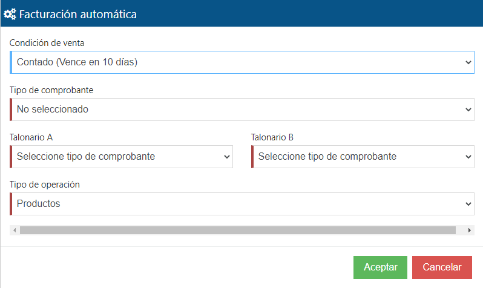

<head>
    
</head>

<h1 align="center">Creacion de aplicaciones desde la WEB</h1>

A traves de la pagina web de [Tango Factura](http://www.tangofactura.com), podes crear tus aplicaciones y asociarlas a tu empresa. A continuacion, te indicaremos paso a paso como tenes que hacerlo.

La ruta para seguir este instructivo es: [Aplicaciones](https://www.tangofactura.com/Home/BsDashboard#9) -> [Tango Factura Connect](https://www.tangofactura.com/PGR/ConfiguracionApi) -> [Aplicaciones](https://www.tangofactura.com/PGR/Aplicaciones)

<h2>1. Crear nueva aplicacion</h2>

<ol>
    <li>Dentro del menu superior, selecciona el boton .</li>
    <li>Se abrira el siguiente formulario para que completes  
    
    </li>
    <li>Luego de cargar los datos solicitados, tendras la informacion de tu Aplicacion  
    
    </li>
    <li>Tendras que autorizar la aplicacion haciendo click en el boton  y permitir la solicitud.</li>
    <li>Si es la primera vez que agregar una aplicacion, deberas configurar la facturacion automatica. Te aparecera la siguiente imagen:  
    
    </li>
    <li>Luego de tocar el boton de Parametros Generales, deberas seleccionar la siguiente opcion: 
        
    </li>
    <li>Y por ultimo, configurala segun tus necesidades a traves del siguiente formulario:  
    
    </li>
</ol>
